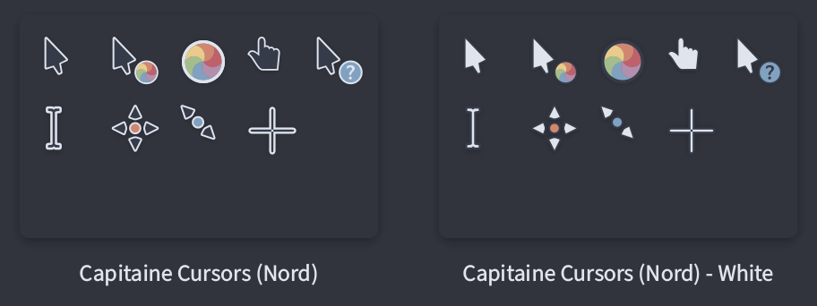

| Variant   | Preview                           |
| :-------- | :-------------------------------- |
| Default   |      |
| Gruvbox   |      |
| Nord      |            |
| Palenight |  |

## About

This is my fork of [capitaine-cursors](https://github.com/keeferrourke/capitaine-cursors), patched with some additional variants (Gruvbox, Nord, Palenight).

## Build from source

Make sure you have the following executables in `$PATH`:

- `inkscape`
- `xcursorgen`
- `bc`
- `sed` (GNU Version)

Clone this repository, cd to the directory and run `./build.sh`.

```
$ ./build.sh -h
This script builds the capitaine-cursor theme.

Usage: ./build.sh [ -d DPI ] [ -t VARIANT ] [ -p PLATFORM ] [ -s STYLE ]
  -h, --help            Print this help
  -d, --max-dpi         Set the max DPI to render. Higher values take longer.
                        One of ( lo tv hd xhd xxhd xxxhd ).
  -t, --type            Specify the build variant. One of ( dark light ).
  -p, --platform        Specify the build platform. One of ( unix win32 ).
  -s, --style           Specify the build style. One of ( Default Nord Gruvbox Palenight ).
```

## Credits

This cursor theme is originally designed by [@keeferrourke](https://github.com/keeferrourke).

The new variants are added by [@sainnhe](https://github.com/sainnhe).
